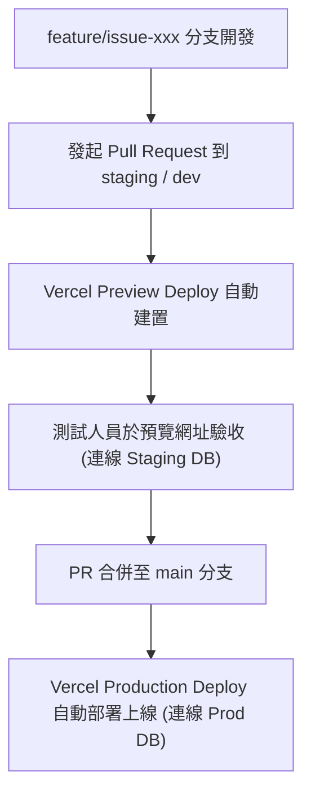

# 上線後工作流與資料庫安全規範 (POST_LAUNCH_WORKFLOW)

本文件定義系統上線後的日常開發工作流、環境分流規範、資料庫安全防護以及 Firestore Schema Migration 安全升級規則，**所有開發團隊成員皆必須嚴格遵守。**

---

## 核心原則：禁止本地 JSON 同步至正式資料庫

1. **Firestore 是唯一真實資料源 (Single Source of Truth)**：
   - 系統上線後，所有正式學員資料、預約紀錄、出席狀態等，皆以線上 Production Firestore 為準。
2. **禁止日常覆寫同步**：
   - 本地 `data/booking-data.json` 僅作為本地開發的離線備用 Dummy 資料或開發測試檔案，**絕對禁止**再次透過同步工具將其寫入或覆蓋到正式 Firestore。
   - 覆寫同步指令 `firestore:DANGER-OVERWRITE-PROD-DO-NOT-USE` **僅限上線初期一次性初始化使用**。日常開發禁止執行此命令。

---

## 本地開發與資料來源分流

為防範本地開發、測試或跑 Unit Tests 時誤打、誤刪或誤改正式 Production 庫的資料，本地環境設定必須遵守以下分流規範：

### 1. 本地 `.env.local` 安全分流
- 本地 `.env.local` 檔中的 `FIREBASE_PROJECT_ID`、`FIREBASE_CLIENT_EMAIL` 及 `FIREBASE_PRIVATE_KEY` **預設不應配置為 Production 正式專案**。
- 日常開發時，本地 `.env.local` 的 `BOOKING_DATA_SOURCE` 應配置為 `json`。
- 若需進行 Firestore 資料存取測試，應連線至 **Staging (測試/沙盒) Firebase 專案**，絕對禁止本地使用 Production 專案的私鑰憑證進行日常開發。

### 2. 本地 `.env.local.example` 規範
本專案已在 [`.env.local.example`](file:///C:/Users/User/codex-projects/union-course-booking/.env.local.example) 中將設定預設為測試用專案，並加註警語引導開發者。

---

## 建議建置 Staging Firebase 專案

為了讓團隊能在最貼近正式環境的狀態下測試：
1. **Staging 專案建置**：
   - 應在 Firebase 控制台建立一個與正式專案隔離的 Staging 專案（例如：`union-course-booking-staging`）。
   - 該專案應啟用相同的 Firestore Database 規則（與 [`firestore.rules`](file:///C:/Users/User/codex-projects/union-course-booking/firestore.rules) 保持同步）。
2. **Staging Vercel Preview Deploy**：
   - 可在 Vercel 中將 Vercel Preview 部署環境變數連線至此 Staging Firebase 專案，讓 Pull Request 的預覽網址自動連到 Staging Firestore 以供行政團隊與測試人員驗收，而 Production 網址則專注連線至正式 Firestore。

---

## Git 分支工作流與正式部署

禁止任何開發人員直接 push 程式碼到 `main` 分支。上線後的部署與發布應採用以下分支管理流程：



### 1. 功能開發分支
- 從 `main` 切出 `feature/功能名稱` 或 `bugfix/問題名稱` 分支。
- 本地開發時，`BOOKING_DATA_SOURCE=json` 或連線至 Staging Firestore。

### 2. 測試與驗收
- 功能完成後，發起 Pull Request 至 `main`（或中間的測試分支，如 `staging`）。
- 使用 Vercel Preview Deployment 自動建置的網址進行多瀏覽器與手機端驗收。

### 3. 生產發布
- 驗收通過後，由管理員審查並將 PR 合併至 `main`。
- Vercel 將自動觸發 Production Build，將最新安全且編譯通過的代碼部署到 [`union-course-booking.vercel.app`](https://union-course-booking.vercel.app)。

---

## Firestore Schema Migration 安全升級規則

未來若有新功能需要更改 Firestore 資料欄位或結構（例如：新增學員欄位、調整預約狀態值等等），**絕對禁止**清空重建資料庫。必須遵循以下相容性升級原則：

### 1. 欄位向下相容 (Backward Compatibility)
- 程式端在讀取舊有 Document 時，必須做好 **Default Value (預設值)** 處理，防範因欄位缺失導致前端渲染崩潰。
  ```typescript
  // 範例：若舊 student 沒有 nationalId 欄位，讀取時做 fallback
  const nationalId = student.nationalId ?? "";
  ```

### 2. 新增非破壞性欄位
- 新增欄位時直接寫入，舊資料在下次更新時再漸進式補齊。
- 若必須一次性為所有舊 Document 補齊新欄位，應撰寫專門的 Migration Script：
  - 放置於 `tools/migrations/migration-xxx.mjs` 中。
  - Script 中**只能進行 Update 操作，絕對不能調用 delete 或是覆寫覆蓋**。
  - 在正式庫執行前，必須先在 Staging DB 上測試成功。

### 3. 大幅結構重構（雙寫策略 - Double Write）
- 若要棄用舊欄位並換到全新結構：
  - **階段一：雙寫**。新代碼同時將資料寫入「舊欄位」與「新欄位」，但讀取仍使用舊欄位。
  - **階段二：資料轉移**。執行背景腳本，將歷史資料的舊欄位轉換並補齊到新欄位。
  - **階段三：切換讀取**。將程式讀取點切換到新欄位。
  - **階段四：移除舊寫入**。穩定後移除舊欄位的寫入與相依程式碼。
  - *（此流程可確保任何時間點回滾程式都不會造成生產環境資料損毀或服務中斷。）*
