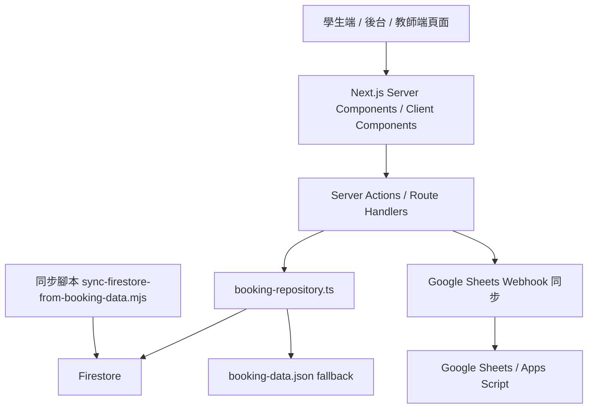
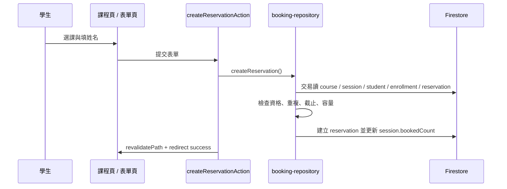

# 系統架構與功能規格

## 1. 文件目的

本文件用來完整說明「工會課程預約系統」目前的系統組成、前端與後端分工、資料模型、Firebase 串接方式、資料同步方式、匯出流程與部署方式。  
目標是讓後續開發者、協作者或 AI 接手時，可以快速理解整個系統如何運作，而不需要先從程式碼逐頁逆推。

## 2. 系統定位

本系統是一套以 **Next.js App Router** 建立的課程預約與名單管理系統，主要服務三種使用情境：

1. 學生端：查看可預約課程、選擇時段、送出預約、查詢預約、截止前取消預約。
2. 工作人員後台：管理課程分類、課程主檔、開課期別、上課時段、學生名單、資格、預約、出席、匯出資料。
3. 教師端：查看自己授課行事曆、進入單堂課頁面、處理點名與教學紀錄。

這是一個 **前後端同 repo、同框架** 的系統：

1. 前端畫面由 Next.js 頁面與 React 元件組成。
2. 後端邏輯主要由 Next.js Server Actions、Route Handlers 與 repository 層負責。
3. 正式資料來源為 Firebase / Firestore。
4. 本機與配額異常時保留 `data/booking-data.json` 作為 fallback。

## 3. 技術架構總覽

### 3.1 技術棧

- Framework：Next.js 16（App Router）
- 語言：TypeScript
- UI：React 19
- 樣式：全域 CSS + Tailwind CSS v4
- 資料庫：Firebase Firestore
- 伺服器端 Firebase SDK：`firebase-admin`
- 匯出：CSV、XLSX
- 行事曆 UI：FullCalendar

### 3.2 架構分層



### 3.3 核心設計原則

1. 以單一 Next.js 專案承載前台、後台、教師端與資料寫入邏輯，降低部署與維運複雜度。
2. 資料存取集中在 `src/lib/booking-repository.ts`，避免頁面直接操作資料庫。
3. Firestore 為正式資料來源，但保留 JSON fallback，避免本機開發或 Firebase 暫時異常時整站中斷。
4. 公開學生端優先使用窄讀取，避免把完整名單或完整預約資料暴露給前台流程。
5. 敏感資料讀寫放在伺服器端，學生端不直接讀取完整 Firestore 集合。

## 4. 專案目錄與職責

### 4.1 主要目錄

- `src/app/`：Next.js 頁面、Server Actions、下載路由。
- `src/components/`：共用前端元件。
- `src/lib/`：資料模型、repository、Firebase 初始化、匯出與同步工具。
- `data/booking-data.json`：本機 JSON 備援資料。
- `tools/`：資料同步與雲端同步腳本。
- `specs/`：規格文件。

### 4.2 關鍵檔案

- `src/lib/booking-repository.ts`
  說明：整個系統最核心的資料存取層，負責讀寫 Firestore 與 JSON fallback。
- `src/lib/firebase-admin.ts`
  說明：初始化 Firebase Admin SDK 與 Firestore 連線。
- `src/lib/data-store.ts`
  說明：讀寫本機 JSON，並把 legacy 結構正規化成目前資料模型。
- `src/lib/types.ts`
  說明：系統主要型別定義。
- `src/app/actions.ts`
  說明：學生端預約與取消的 Server Actions。
- `src/app/admin/actions.ts`
  說明：後台大部分新增、修改、刪除、點名、匯入、匯出觸發入口。
- `src/app/teaching/actions.ts`
  說明：教師端點名與教學紀錄寫入入口。
- `tools/sync-firestore-from-booking-data.mjs`
  說明：把 `booking-data.json` 批次備份後同步進 Firestore。

## 5. 前端系統組成

### 5.1 學生端

#### 主要路由

- `/`
  顯示學生端首頁與課程列表，資料來源使用 `getCourseCatalog()`。
- `/courses/[courseId]`
  顯示單一課程的資訊與可預約時段。
- `/courses/[courseId]/book/[sessionId]`
  顯示預約表單。
- `/booking/success`
  顯示預約完成頁。
- `/booking/search`
  讓學生以姓名 + 身分資訊末三碼查詢與取消預約。

#### 前端功能

1. 顯示可報名課程與時段。
2. 顯示額滿狀態，但額滿課程不從畫面移除。
3. 提供預約送出表單。
4. 顯示最近一次成功預約。
5. 提供查詢與取消功能。

#### 前端處理方式

1. 學生端頁面多為 Server Component，先在伺服器抓資料再輸出 HTML。
2. 預約與取消不直接由瀏覽器呼叫資料庫，而是提交到 Server Actions。
3. 公開頁面優先使用 `getCourseCatalog()`，只抓分類、課程與時段，不抓完整預約名單與完整學生資料。

### 5.2 後台

#### 後台登入與保護

- `/admin/login`
  由 `src/app/admin/login/actions.ts` 驗證密碼。
- `/admin/:path*`
  由 `src/proxy.ts` 檢查 `admin_session` cookie。

#### 主要路由

- `/admin`
  後台首頁，顯示今日課程、近期待辦與入口。
- `/admin/course-categories`、`/admin/categories`
  管理課程分類。
- `/admin/course-masters`
  管理課程系列 / 主檔。
- `/admin/course-offerings`
  管理期別 / 開課班次。
- `/admin/courses`
  檢視課程與工作區入口。
- `/admin/courses/[courseId]`
  單一課程工作區。
- `/admin/courses/[courseId]/sessions`
  管理某課程的時段。
- `/admin/course-sessions`
  以全域視角管理課堂時段。
- `/admin/sessions/[sessionId]/reservations`
  單堂課的名單、預約、出席與課堂紀錄頁。
- `/admin/students`
  管理學生、資格、講師與相關資料。
- `/admin/students/[studentId]`
  學生個別檔案。
- `/admin/stats`
  統計頁。
- `/admin/exports`
  CSV、XLSX、Google Sheets 同步入口。
- `/admin/weekly-bookings`
  週內預約與上課視圖。
- `/admin/full-classes`
  額滿課程視圖。
- `/admin/booking-locks`
  預約截止 / 鎖定視圖。
- `/admin/todos`
  待辦檢視頁。

#### 後台功能

1. 管理分類、課程系列、開課期別與課堂時段。
2. 管理學生名單、資格、講師與課程關聯。
3. 手動新增 / 取消預約。
4. 處理出席、遲到、請假、缺席。
5. 編輯課堂教學紀錄與異常追蹤。
6. 匯出 CSV / XLSX。
7. 觸發 Google Sheets 同步。

### 5.3 教師端

#### 主要路由

- `/teaching/login`
  教師輸入姓名後進入教師端。
- `/teaching`
  教師自己的教學行事曆與今日授課總覽。
- `/teaching/sessions/[sessionId]`
  教師單堂課工作頁。

#### 教師端功能

1. 依教師姓名過濾自己相關課程。
2. 查看月曆與單日課程。
3. 進入單堂課頁後做點名。
4. 補建 roster reservation 後再寫入出席。
5. 填寫教學內容、教師備註、異常與追蹤紀錄。

#### 教師端授權方式

目前不是完整帳號密碼登入，而是依教師姓名對應課程 / 講師資料判斷：

1. 用姓名比對 `instructors` 中的講師。
2. 再比對課程與時段上的 `instructorId`、`assistantInstructorIds`、`instructorName`、`assistantInstructorNames`。
3. 只有比對成功的教師，才能在教師端操作該堂課資料。

這代表教師端目前是「輕授權」模式，適合內部先行使用，但正式上線若需要更強安全性，後續應改成正式帳號機制。

## 6. 後端系統組成

### 6.1 Server Actions

系統主要使用 Next.js Server Actions 處理寫入。

#### 學生端

- `createReservationAction()`
- `cancelReservationAction()`

#### 後台

位於 `src/app/admin/actions.ts`，包括：

1. 預約與取消。
2. 出席更新。
3. 名單補建。
4. 課堂紀錄儲存。
5. 類別、課程、期別、時段、學生、講師的 upsert / delete。
6. 匯入與同步觸發。

#### 教師端

位於 `src/app/teaching/actions.ts`，包括：

1. `updateTeachingAttendanceAction()`
2. `completeTeachingAttendanceAction()`
3. `saveTeachingJournalAction()`

### 6.2 Route Handlers

#### 匯出路由

- `/admin/exports/download`
  下載指定 CSV。
- `/admin/exports/xlsx`
  產生 XLSX 檔案。
- `/admin/sessions/[sessionId]/reservations/export`
  匯出單堂名單資料。

### 6.3 Repository 層

`src/lib/booking-repository.ts` 是實際資料讀寫中樞，負責：

1. 依 `BOOKING_DATA_SOURCE` 判斷是否使用 Firestore。
2. Firestore 可用時，執行正式讀寫。
3. Firestore 初始化失敗或操作失敗時，自動 fallback 到 JSON。
4. 把頁面與資料庫的耦合收斂在單一層。

這一層不是單純 CRUD，還包含大量業務規則，例如：

1. 預約資格判斷。
2. 同課程不可重複預約判斷。
3. 預約截止時間判斷。
4. 額滿判斷。
5. 點名狀態換算。
6. 自動補 reservation 以支援 roster 課程點名。
7. session / offering / student 相關連動刪除。

### 6.4 JSON fallback 層

`src/lib/data-store.ts` 負責：

1. 從 `data/booking-data.json` 讀資料。
2. 把舊版 `courses[].sessions` 結構正規化。
3. 從 reservation 自動補 student、enrollment、attendanceRecord、entitlement 等衍生資料。
4. 寫回格式化後的 JSON。

這一層的作用不是正式資料庫，而是：

1. 本機開發備援。
2. Firestore 配額或連線異常時不中斷流程。
3. 舊資料格式轉新資料模型的過渡層。

## 7. Firebase / Firestore 架構

### 7.1 Firestore 初始化

`src/lib/firebase-admin.ts` 支援兩種初始化方式：

1. 直接使用 `.env.local` 中的：
   - `FIREBASE_PROJECT_ID`
   - `FIREBASE_CLIENT_EMAIL`
   - `FIREBASE_PRIVATE_KEY`
2. 或使用 `GOOGLE_APPLICATION_CREDENTIALS`

初始化成功後回傳 Firestore instance；若沒有可用憑證，repository 會改走 JSON fallback。

### 7.2 正式資料來源切換

由環境變數控制：

```text
BOOKING_DATA_SOURCE=firestore
```

若不是 `firestore`，系統就直接讀本機 JSON。

### 7.3 Firestore 主要集合

目前 repository 會讀寫以下主要集合：

- `categories`
- `courses`
- `sessions`
- `students`
- `reservations`
- `courseSeries`
- `courseOfferings`
- `courseSessions`
- `studentCourseRecords`
- `enrollments`
- `attendanceRecords`
- `instructors`
- `entitlements`
- `importBatches`

### 7.4 為什麼同時存在 `courses` 與 `courseOfferings`

系統目前處於 legacy 模型與新模型並存的階段：

1. `courses`
   仍提供舊頁面與學生端主要使用，內含 `sessions`。
2. `courseSeries`
   代表課程系列 / 主檔層級。
3. `courseOfferings`
   代表某年期別、某一班實際開課。
4. `courseSessions`
   代表新模型的單堂課紀錄。

`data-store.ts` 會把 legacy `courses` 轉成 `courseSeries`、`courseOfferings`、`courseSessions` 等正規化資料，讓系統能逐步過渡，而不是一次重構全部頁面。

## 8. 主要資料模型

### 8.1 課程結構

#### Category

用來分類課程，例如不同課程大類，包含排序、顏色、啟用狀態。

#### CourseSeries

代表同一門課的長期主檔，例如某類訓練的系列定義。

#### CourseOffering

代表某一次實際開課，通常帶有：

1. 年度 / 期別
2. 顯示名稱
3. 地點
4. 容量
5. 開放預約狀態

#### CourseSession

代表一堂具體課程時段，包含：

1. 日期
2. 起訖時間
3. 地點
4. 容量
5. 已預約數
6. 截止時間
7. 講師
8. 教學紀錄與異常欄位

### 8.2 學生與預約結構

#### Student

代表學生身份資料，可能來自：

1. 前台預約自動生成
2. Excel / CSV 匯入
3. 後台手動建立

#### Reservation

代表一次預約，核心欄位包括：

1. `courseId`
2. `sessionId`
3. `studentName`
4. `phoneLastThree`
5. `status`
6. `attendanceStatus`

#### Enrollment

代表學生對某個 offering / series 的名單或資格關係，用來支援固定名冊課程。

#### AttendanceRecord

代表出席紀錄，是較正規化的點名資料。

#### StudentCourseRecord

代表從外部表單或 Excel 匯入的資格、修課或歷史資訊。

#### Entitlement

代表某些課程模式下，學生因出席而取得的後續權益，例如補課或重修有效期。

## 9. 前後端如何串接

### 9.1 學生預約流程



#### 預約時後端會做的事

1. 取得課程與時段。
2. 驗證課程是否可預約。
3. 驗證學生是否在可預約名單內。
4. 檢查同一堂是否重複預約。
5. 檢查是否超過截止時間。
6. 檢查是否額滿。
7. 建立 reservation。
8. 更新 session 的 `bookedCount`。

### 9.2 學生查詢 / 取消流程

1. 學生在 `/booking/search` 輸入姓名與末三碼。
2. Server 端查詢符合條件的 reservation。
3. 學生送出取消時，由 `cancelReservationAction()` 呼叫 repository。
4. repository 更新 reservation 狀態、取消時間，並回寫 session 名額。
5. 完成後 revalidate 前台與後台相關頁面。

### 9.3 後台點名流程

1. 後台頁面送出 attendance 變更。
2. `updateAttendanceAction()` 或 `updateRosterAttendanceAction()` 接收資料。
3. 若是固定名冊課程，系統會先確保該學生在該 session 下有 reservation。
4. repository 依狀態更新：
   - `attended`
   - `late`
   - `leave`
   - `absent`
   - `pending`
5. 完成後更新頁面快取。

### 9.4 教師端點名流程

與後台類似，但會先驗證教師是否有權處理該堂課，再進行 reservation / attendance 更新。

## 10. 預約規則與業務邏輯

### 10.1 學生身份判斷

目前核心識別基礎為：

1. `studentName`
2. `phoneLastThree` / `idNumberLast3`

### 10.2 重複預約規則

repository 會避免不合理重複預約，重點包含：

1. 同學生不可在同堂課建立重複有效預約。
2. 同一課程的資格與名單關係會一併檢查。

### 10.3 預約截止規則

`course-utils.ts` 內的 `getReservationCutoff()`、`canChangeReservation()` 會計算可否變更預約。  
目前程式採「課前一段時間截止」機制，並可讀取 session 自身的 `bookingDeadline`。

### 10.4 額滿規則

1. `session.bookedCount >= session.capacity` 時不可新增預約。
2. 前台仍顯示該課程，但狀態標示為額滿。

### 10.5 課程模式

`course-utils.ts` 把課程模式正規化成三種主邏輯：

1. `booking_flexible`
   學生可自行預約。
2. `fixed_roster`
   以固定名冊為主，通常不由學生自由報名。
3. `subsidy_roster`
   補助或特定名冊制課程。

這個模式會影響：

1. 前台是否顯示預約入口。
2. 後台如何補名單。
3. 教師端如何點名。

## 11. Firestore 與 JSON 的雙軌策略

### 11.1 讀取策略

#### 公開頁面

使用 `getCourseCatalog()`：

1. 只讀分類、課程與時段。
2. 避免讀取完整預約資料與學生個資。

#### 後台 / 教師端

使用 `getBookingData()`：

1. 讀完整集合。
2. 提供名單、點名、資格、統計所需資料。

### 11.2 寫入策略

#### 平常營運

平時線上操作是：

1. 前台 / 後台 / 教師端的 Server Actions
2. 直接呼叫 repository
3. repository 直接寫 Firestore

#### Firestore 異常時

若 Firestore 初始化或存取失敗：

1. repository 會記錄 warning
2. 自動 fallback 到 JSON
3. 讓本機流程盡量繼續可用

這是可用性優先的設計，但也代表正式環境應持續監控 Firestore 是否真的正常運作，避免 fallback 被誤當成正式資料流。

## 12. 資料如何推到 Firebase

這部分分成兩種情境。

### 12.1 線上操作即時推送

平常系統運作時，不需要另外手動「推播」：

1. 使用者在頁面上提交表單。
2. Server Action 收到請求。
3. repository 直接呼叫 Firestore SDK 寫入。
4. 寫完後透過 `revalidatePath()` 讓相關頁面重新取資料。

也就是說，**正式系統的日常寫入是即時寫入 Firestore，不是先寫本機再批次上傳。**

### 12.2 JSON 批次同步到 Firestore

若手上有一份 `data/booking-data.json`，要把它整批推到 Firestore，使用：

- `tools/sync-firestore-from-booking-data.mjs`

#### 腳本作用

1. 讀取 `data/booking-data.json`
2. 初始化 Firebase Admin
3. 先列出或備份 Firestore 現有資料
4. 清除指定集合
5. 以 `id` 為文件 id 重建資料

#### 支援模式

1. `--dry-run`
   只檢查線上 collection 與本地資料數量，不寫入。
2. `--apply`
   先備份再清除再重建。

#### 備份位置

- `firestore-backups/<timestamp>/`

#### 這條流程適合什麼時候用

1. 初次把本地 JSON 匯入正式 Firestore。
2. 做資料重建。
3. 測試環境重置。
4. schema 過渡期重新灌資料。

#### 這條流程不適合什麼時候用

1. 日常使用者預約。
2. 正式環境頻繁覆蓋線上資料。
3. 不清楚線上資料差異時直接重灌。

因為 `--apply` 會先刪再寫，是破壞性同步。

## 13. 對外同步與匯出

### 13.1 CSV 匯出

`src/lib/sheet-export.ts` 定義多張資料表輸出格式，匯出資料包含：

1. students
2. courseSeries
3. courseOfferings
4. courseSessions
5. reservations
6. attendanceRecords
7. entitlements
8. studentCourseRecords
9. instructors
10. importBatches
11. enrollments
12. categories

使用方式：

1. 後台 `Admin Exports` 頁面選擇資料表。
2. 透過 `/admin/exports/download?table=...` 下載 CSV。

### 13.2 XLSX 匯出

`/admin/exports/xlsx` 會產生整包 XLSX，適合拿去給 Google Drive / Excel 開啟。

### 13.3 Google Sheets 同步

#### 串接方式

1. 後台按下同步按鈕。
2. `syncGoogleSheetsAction()` 呼叫 `syncGoogleSheets()`
3. 系統把 `EXPORT_TABLES` 對應資料整理成 payload。
4. 透過 `fetch()` POST 到 `GOOGLE_SHEETS_WEBHOOK_URL`
5. 由 Google Apps Script / webhook 端寫入 Google Sheet。

#### 必要環境變數

- `GOOGLE_SHEETS_WEBHOOK_URL`
- `GOOGLE_SHEETS_SYNC_TOKEN`

#### 設計目的

1. 讓後台資料可同步到 Google Sheets 做人工整理或外部交接。
2. 不讓前端直接接觸 Google APIs 複雜授權流程。

## 14. 安全與權限

### 14.1 後台

1. 後台用共享帳號模式。
2. `/admin/login` 驗證 `ADMIN_PASSWORD`。
3. 成功後寫入 `admin_session` cookie。
4. `src/proxy.ts` 針對 `/admin/:path*` 做 cookie 驗證。

#### 需要的環境變數

- `ADMIN_PASSWORD`
- `ADMIN_SESSION_SECRET`

### 14.2 教師端

目前教師端是輕授權，依姓名與講師資料關聯判斷，尚非正式認證系統。

### 14.3 個資風險

1. 學生資料、預約與名冊含個資。
2. Firebase 金鑰與 `.env.local` 不能提交版本庫。
3. 公開頁面不可直接使用完整 `getBookingData()`。

## 15. 快取與重新整理策略

系統在寫入後大量使用 `revalidatePath()`，確保：

1. 學生首頁更新剩餘名額。
2. 課程詳情更新預約狀態。
3. 查詢頁更新取消後狀態。
4. 後台名單、統計、課程頁同步刷新。
5. 教師端課堂頁刷新出席資訊。

這表示目前資料更新策略偏向「寫入後明確 revalidate 相關頁面」，而不是完全依賴 client-side 即時狀態管理。

## 16. 部署與執行環境

### 16.1 本機開發

```text
http://127.0.0.1:3100
```

常用指令：

```bash
npm.cmd run dev -- --hostname 127.0.0.1 --port 3100
npm.cmd run lint
npm.cmd run build
```

### 16.2 雲端與版本管理

1. Repo 已連到 Vercel 專案 `union-course-booking`。
2. GitHub repo 為 `SC-Luo/union-course-booking`。
3. 另有 Google Drive 同步資料夾做原始碼備份。

### 16.3 雲端同步腳本

#### 同步到雲端備份

- `tools/sync-to-cloud.ps1`

#### 從雲端同步回本機

- `tools/sync-from-cloud.ps1`

#### 注意事項

不要把 `node_modules` 放進 Google Drive 同步資料夾，避免大量小檔寫入失敗與同步異常。

## 17. 已知限制與後續建議

### 17.1 已知限制

1. 資料模型仍處於 legacy `courses` 與新 `courseOfferings` 並存階段。
2. 教師端目前沒有正式帳號驗證。
3. fallback 到 JSON 雖然提高可用性，但正式營運需要更明確監控與告警。
4. Firestore 公開頁仍需持續關注讀取量。
5. 一些後台頁面仍在穩定化與 UX 調整階段。

### 17.2 建議下一步

1. 逐步把前後端全部收斂到 `courseSeries / courseOfferings / courseSessions` 正規模型。
2. 為教師端補正式認證與角色權限。
3. 為 Firestore fallback 增加更清楚的告警機制。
4. 視流量導入公開課程快取或彙總資料。
5. 補完整驗收清單與操作測試腳本。

## 18. 系統一句話總結

這套系統本質上是：

**用 Next.js 建立的單體式課程預約平台，透過 Server Actions 與 repository 層把學生端、後台與教師端串到 Firestore，並保留 JSON fallback、批次同步腳本與 Google Sheets 匯出 / 同步能力，支撐課程預約、名單管理、點名與資料交接。**
